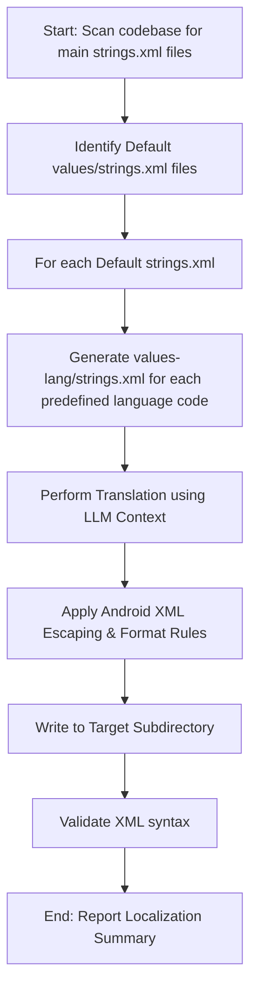

# 🌐 Android Localization & Translation Skill

This skill configures the AI agent to localize all default Android `strings.xml` resources across all modules in the project into the predefined set of target languages. The translation is performed directly by the agent using its LLM language translation capabilities, without external scripts or API calls.

---

## 🎯 Target Languages & Directories

Translate the default strings to the following language codes:

| Language | Code | Android Resource Directory |
| :--- | :---: | :--- |
| Vietnamese | `vi` | `values-vi` |
| Spanish | `es` | `values-es` |
| French | `fr` | `values-fr` |
| German | `de` | `values-de` |
| Chinese | `zh` | `values-zh` |
| Japanese | `ja` | `values-ja` |
| Korean | `ko` | `values-ko` |
| Arabic | `ar` | `values-ar` |
| Italian | `it` | `values-it` |
| Portuguese | `pt` | `values-pt` |
| Russian | `ru` | `values-ru` |
| Turkish | `tr` | `values-tr` |
| Indonesian | `in` | `values-in` |
| Malay | `ms` | `values-ms` |
| Thai | `th` | `values-th` |
| Ukrainian | `uk` | `values-uk` |
| Polish | `pl` | `values-pl` |
| Dutch | `nl` | `values-nl` |
| Swedish | `sv` | `values-sv` |
| Croatian | `hr` | `values-hr` |
| Serbian | `sr` | `values-sr` |
| Hindi | `hi` | `values-hi` |
| Filipino | `fil` | `values-fil` |

---

## 📋 Translation Workflow

You MUST create a task list and complete them in order:

---

## 🛠️ Detailed Implementation Guide

### 1. Scan for default `strings.xml` files
- Identify all modules that contain a default `strings.xml` file.
- Look for files ending with `src/main/res/values/strings.xml`.
- Exclude already-localized folders (`values-<lang>`) when looking for source strings.

### 2. Translation Process
For each default `strings.xml` file:
- Read its contents.
- For each target language directory listed in the **Target Languages & Directories** table:
  - Check if `values-<lang>/strings.xml` already exists.
  - If it exists, read it to preserve any custom translations or only translate new strings that are present in the default file but missing in the localized file.
  - Translate the inner text of each `<string>` tag to the target language.
  - **DO NOT** translate:
    - String names (e.g., `<string name="locked_lesson_title">` must retain the name `locked_lesson_title`).
    - Strings marked with `translatable="false"`.
    - Placeholders (e.g., `%s`, `%d`, `%1$s`, `%2$d` must remain exactly as-is).

### 3. Android XML String Formatting & Escaping Rules
Ensure you follow all Android XML styling requirements:
- **Apostrophes / Single Quotes**: Escape single quotes `'` as `\'`.
  - *Correct*: `This lesson isn\'t next`
  - *Incorrect*: `This lesson isn't next`
- **Double Quotes**: Escape double quotes `"` as `\"`.
- **Ampersands**: Escape ampersands `&` as `&amp;`.
- **Special Characters**: Escape `<` as `&lt;` and `>` as `&gt;` unless they are standard HTML formatting tags (`<b>`, `<i>`, `<u>`).
- **Placeholder Position**: Ensure format string arguments (`%1$s`, `%2$d`, etc.) are placed appropriately based on the target language grammar, keeping their specifiers unchanged.
- **XML Header**: Keep `<?xml version="1.0" encoding="utf-8"?>` and the `<resources>` wrapper tags intact.

### 4. Saving Localized Resources
- Create the target folder if it does not exist (e.g., `src/main/res/values-<lang>/`).
- Write the translated XML content using `write_to_file`.

### 5. Validation
- Run a basic syntax check to ensure all XML tags are closed properly and that special characters are correctly escaped.
- Ensure the file compiles under Android's resource compiler by running `./gradlew assembleDebug` (or using the Gradle MCP server if available) after translation.

---

## 🚫 Hard Constraints
- **Do NOT write external scripts** (e.g., Python, Bash) or make external HTTP/API requests for translation.
- **Do NOT use placeholders** or stub comments like `<!-- TODO: Translate this -->`. Translate every string completely.
- Use the LLM's own language processing and contextual understanding to perform the translations directly.
