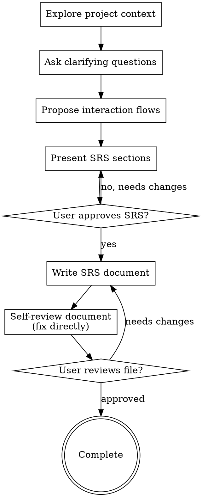

# Create SRS Document

Transform ideas into functional specification documents through Q&A.

Understand project context, ask questions one at a time to clarify interface and interactions. When clear enough, present SRS and get user approval.

<HARD-GATE>
DO NOT mention technical implementation, system architecture, or code. Only describe functionality, interface, user actions, and system actions.
</HARD-GATE>

## Checklist

You MUST create a task list and complete them in order:

1. **Explore project context** — check files, documents, recent commits.
2. **Ask clarifying questions** — ask ONE QUESTION AT A TIME, focusing on:
   - What components are on the screen?
   - What can users do?
   - How does the system respond?
3. **Propose 2-3 functional flows/layouts** — present options with pros and cons.
4. **Present each section of SRS** — request user approval after each section.
5. **Write SRS document** — save to `docs/<feature name>/01-srs.md`.
6. **Self-review document** — check for placeholders, contradictions, technical/code elements.
7. **User reviews document** — request user to review the SRS file before completion.

## Process Diagram

## Implementation Process

**Understand functional requirements:**

- Assess current project state before starting.
- Ask clarifying questions one aspect at a time.
- Identify **ALL** components on the screen and confirm with User before describing SRS.
- **ESPECIALLY DO NOT INFER** any component, behavior, or response if User hasn't confirmed.
- Prioritize multiple-choice questions.
- **Only ask one question at a time** - don't bundle multiple ideas into one question.
- Focus on listing completely:
  - **UI Components:** Text, Button, Image, List, Form...
  - **User interactions:** Click, Swipe, Scroll, Input text...
  - **System responses:** Show loading, display Toast, validation errors, navigate to screen...
- ABSOLUTELY DO NOT discuss database, API, folder structure, or technologies used.

**Explore functional approaches:**

- Propose 2-3 ways to layout interface or user flows.
- Present conversationally, provide suggestions and reasoning.

**Present SRS:**

- When functionality is clear, present each SRS section.
- Ask user if that section matches their intent before moving to the next.
- Content includes: list of screens, components on each screen, interaction scenarios `User actions -> System actions`.

## After Functional Design

**Documentation:**

- Write approved SRS to `docs/<feature name>/01-srs.md`.

**Self-check document:**

After writing document, check:

1. **Placeholders:** No "TBD", "TODO", missing sections.
2. **Consistency:** User actions lead to logical system actions.
3. **Technical elements:** No code, database, architecture.
4. **Clarity:** No ambiguous functionality.

Fix directly in file then proceed.

**User Review Gate:**
After writing, request user to review the file:

> "I've written the SRS document at `<path>`. Please review and let me know if any changes are needed before we move to the next steps."

Wait for feedback. If changes needed, fix and return to review loop. When user agrees, complete the skill.

## Core Principles

- **One question at a time** - Don't overwhelm user with multiple questions.
- **Prioritize multiple-choice** - Easier to answer than open-ended questions.
- **No technical details** - Absolutely no discussion of code, architecture, DB.
- **Confirm each step** - Present each section and get agreement before continuing.
- **Focus only on functionality** - Display components, User interactions, System responses.
