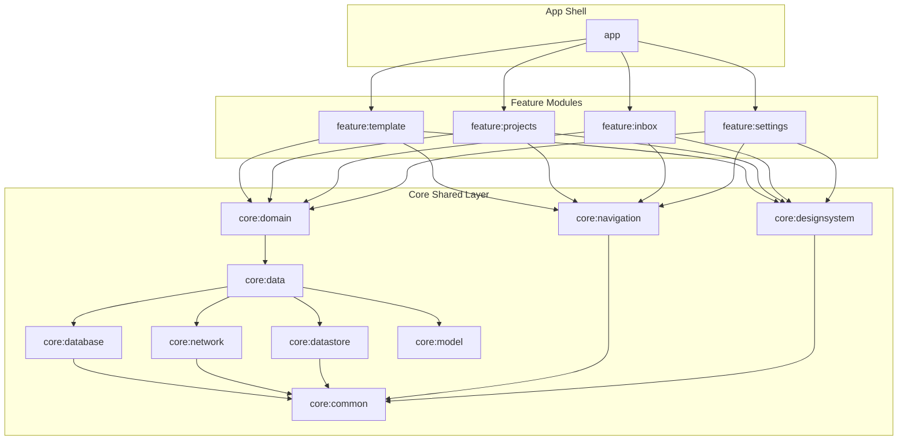

# System Architecture Design

SkillHub is structured around a decoupled, modularized modern Android codebase. It leverages **Modular Clean Architecture**, **Orbit MVI (Model-View-Intent)** for state management, **Jetpack Navigation 3** for type-safe native navigation, and **Dagger Hilt** for dependency injection.

This document outlines the architectural patterns, modules, data flow, and provides an exhaustive developer guide detailing how to build new screen flows matching the project's standard reference implementation, **`:feature:template`**.

---

## 🎨 1. Executive Summary

* **Paradigm:** Modular Clean Architecture.
* **UI/State Paradigm:** Unidirectional Data Flow (UDF) via Orbit MVI.
* **Routing System:** Strongly-typed Jetpack Navigation 3 (eliminates route strings in favor of Serializable Kotlin objects).
* **Styling Framework:** Custom high-fidelity Design System (`AppTheme`, `AppText`, `AppPanel`, `AppButton`) styled on top of Jetpack Compose.
* **Local Persistence:** Room Database cache with Tencent MMKV fast key-value store.

---

## 🛠️ 2. Detailed Tech Stack

| Category | Technology | Version | Description & Rationale |
| --- | --- | --- | --- |
| **Language** | Kotlin | `2.1.0` | Native Android language, compiled with Kotlin 2 Compose compiler plugin. |
| **UI Framework** | Jetpack Compose | `2026.05.00` | Declarative modern Android native UI kit. |
| **State / MVI** | Orbit MVI | `11.0.0` | Implements lightweight, type-safe MVI Containers (`UiState`, `Action`, `SideEffect`). |
| **Navigation** | Jetpack Navigation 3 | `1.1.1` | Native Android type-safe Navigation 3 API (`navigation3-runtime`, `navigation3-ui`). |
| **Dependency Injection** | Dagger Hilt | `2.53` | Standardized framework for Hilt compile-time dependency injection. |
| **Local DB** | Room Database | `2.6.1` | Relational offline-first caching database with SQLite. |
| **KV Storage** | Tencent MMKV | `1.3.14` | Ultra-fast `mmap`-backed preferences engine replacing `SharedPreferences`. |
| **Network Client** | Retrofit | `2.9.0` | REST API framework for Android and JVM. |
| **HTTP Helper** | Skydoves Sandwich | `2.0.8` | Standard API response wrapper (`ApiResponse`) for error and exception modeling. |

---

## 📦 3. Modularization Strategy

The codebase is organized into highly specialized Gradle sub-modules to preserve strict dependency boundaries and fast builds:



---

## 🚀 4. MVI Pattern Reference Tutorial (How to implement features like `:feature:template`)

This section is the **Gold Standard Reference Guide** for building new screens in SkillHub. All new feature additions **MUST** strictly follow this exact 5-step MVI structure.

### Step 1: Define the Route in `:core:navigation`
Add the Serializable and Parcelable route to the sealed interface `Route` in `:core:navigation` (`com.genesys.core.navigation.Route`). This allows other modules to navigate to it safely without importing your feature module.

```kotlin
@Serializable
@Parcelize
data object Templates : Route

@Serializable
@Parcelize
data class TemplateDetail(val templateId: String) : Route
```

### Step 2: Define the MVI Contract (`[Feature]Contract.kt`)
Create your MVI contract in your feature package (e.g. `com.genesys.feature.template.main.MainContract.kt`). It declares:
* **`UiState`**: Immutable state representation of the screen.
* **`Action`**: User intents (clicks, typing, lifecycle triggers) sent to the ViewModel.
* **`SideEffect`**: One-off events (like navigating, popping, displaying a snackbar) that are not kept in state.

```kotlin
data class MainUiState(
    val templateCollections: List<TemplateCollections> = emptyList(),
    val isLoading: Boolean = false,
    val errorMessage: String? = null
) : UiState

sealed interface MainAction : Action {
    data object LoadTemplates : MainAction
    data class OnTemplateClicked(val template: Template) : MainAction
}

sealed interface MainSideEffect : SideEffect {
    data class OpenTemplate(val templateId: String) : MainSideEffect
}
```

### Step 3: Implement the ViewModel (`[Feature]ViewModel.kt`)
Inherit from `BaseViewModel` (from `:core:common`). Inject your UseCases, override `container`, and handle actions inside `onAction()` using Orbit's `intent` block.

```kotlin
@HiltViewModel
class MainViewModel @Inject constructor(
    private val getAllTemplatesUseCase: GetAllTemplatesUseCase
) : BaseViewModel<MainUiState, MainSideEffect, MainAction>() {

    // Initialize state container
    override val container = container<MainUiState, MainSideEffect>(MainUiState())

    init {
        loadTemplates()
    }

    override fun onAction(action: MainAction) {
        when (action) {
            MainAction.LoadTemplates -> loadTemplates()
            is MainAction.OnTemplateClicked -> onTemplateClicked(action.template)
        }
    }

    private fun loadTemplates() = intent {
        if (state.isLoading) return@intent
        
        getAllTemplatesUseCase().collect { result ->
            when (result) {
                is Result.Loading -> reduce {
                    state.copy(isLoading = true, errorMessage = null)
                }
                is Result.Success -> reduce {
                    state.copy(templateCollections = result.data, isLoading = false, errorMessage = null)
                }
                is Result.Error -> reduce {
                    state.copy(isLoading = false, errorMessage = result.msg ?: "Failed")
                }
                is Result.Initial -> Unit
            }
        }
    }

    private fun onTemplateClicked(template: Template) = intent {
        postSideEffect(MainSideEffect.OpenTemplate(template.id))
    }
}
```

### Step 4: Write the Stateless Compose Screen (`[Feature]Screen.kt`)
A purely stateless composable that receives a `UiState` and outputs events via callback lambdas.

```kotlin
@Composable
fun TemplateScreen(
    state: MainUiState,
    onRetry: () -> Unit,
    onTemplateClick: (Template) -> Unit,
    modifier: Modifier = Modifier
) {
    AppPageFrame(
        modifier = modifier,
        contentPadding = PaddingValues(0.dp)
    ) {
        when {
            state.isLoading -> {
                LoadingIndicator(modifier = Modifier.fillMaxSize())
            }
            state.errorMessage != null -> {
                ErrorState(
                    message = state.errorMessage ?: "Failed to load templates",
                    onRetry = onRetry,
                    modifier = Modifier.fillMaxSize()
                )
            }
            else -> {
                TemplateCollectionsList(
                    collections = state.templateCollections,
                    onTemplateClick = onTemplateClick
                )
            }
        }
    }
}
```

### Step 5: Wire Navigation via Feature Graph (`[Feature]Graph.kt`)
Each feature module exposes a Composable `Graph` function (e.g. `TemplateGraph.kt` under `navigation/`). It hoists the Hilt ViewModel, binds state and side-effects, and maps the Navigation 3 Route entries.

```kotlin
@Composable
fun TemplateGraph(
    backStack: NavBackStack<NavKey>,
    navigator: AppNavigator,
    modifier: Modifier = Modifier,
    viewModel: MainViewModel = hiltViewModel()
) {
    // 1. Bind State & Side Effects
    val state by viewModel.collectAsState()

    viewModel.collectSideEffect { sideEffect ->
        when (sideEffect) {
            is MainSideEffect.OpenTemplate -> {
                navigator.navigate(Route.TemplateDetail(sideEffect.templateId))
            }
        }
    }

    // 2. Map Route objects to Composable screens
    val entries = entryProvider<NavKey> {
        entry<Route.Templates> {
            TemplateScreen(
                state = state,
                onRetry = { viewModel.onAction(MainAction.LoadTemplates) },
                onTemplateClick = { template ->
                    viewModel.onAction(MainAction.OnTemplateClicked(template))
                },
                modifier = modifier
            )
        }

        entry<Route.TemplateDetail> { destination ->
            TemplateDetailScreen(
                templateId = destination.templateId,
                onBack = navigator::popIfPossible,
                modifier = modifier
            )
        }
    }

    // 3. Render current active screen
    NavDisplay(
        backStack = backStack,
        onBack = navigator::popIfPossible,
        entryProvider = entries,
        modifier = modifier
    )
}
```

---

## 💾 5. Data & Local Caching Flow

1. **Repository Synchronization:** UseCases within `:core:domain` request data from repositories in `:core:data`.
2. **Local Caching (Offline First):** The repositories check Tencent MMKV via `MMKVData.lastFetchTemplateTime` to see if cached data is still valid.
3. **Database Read:** If cache is valid, the repo pulls `TemplateCollectionsEntity` from `TemplateCollectionsDao`.
4. **Database Write:** If cache is expired or missing, Retrofit fetches `ResponseAITemplate` from the remote backend. On success, models are converted to local Room entities, stored in `TemplateDatabase`, and the last fetch time is written to `MMKVData.lastFetchTemplateTime`.
