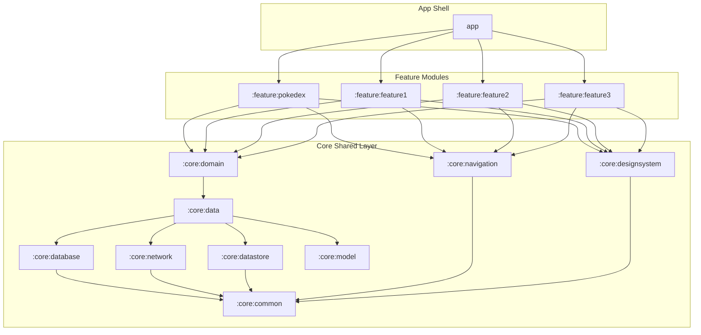

[//]: # ( [MermaidChart: 7b5c2ed5-a3eb-41e8-a372-9f36c95a33a6]
[//]: # ( [MermaidChart: 7b5c2ed5-a3eb-41e8-a372-9f36c95a33a6]
[//]: # ( [MermaidChart: edb24f51-50ad-477b-ac92-82bbf4b61d55]
# System Architecture Design

SkillHub is structured around a decoupled, modularized modern Android codebase. It leverages **Modular Clean Architecture**, **Orbit MVI (Model-View-Intent)** for state management, **Jetpack Navigation 3** for type-safe native navigation, and **Dagger Hilt** for dependency injection.

This document outlines the architectural patterns, modules, data flow, and provides an exhaustive developer guide detailing how to build new screen flows matching the project's standard reference implementation, **`:feature:pokedex`**.

---

## 🎨 1. Executive Summary

* **Paradigm:** Modular Clean Architecture.
* **UI/State Paradigm:** Unidirectional Data Flow (UDF) via Orbit MVI.
* **Routing System:** Strongly-typed Jetpack Navigation 3 (eliminates route strings in favor of Serializable Kotlin objects).
* **Styling Framework:** Custom high-fidelity Design System (`AppTheme`, `AppText`, `AppPanel`, `AppButton`) styled on top of Jetpack Compose.
* **Local Persistence:** Room Database cache with Tencent MMKV fast key-value store.

---

## 🛠️ 2. Detailed Tech Stack

| Category | Technology | Version | Description & Rationale |
| --- | --- | --- | --- |
| **Language** | Kotlin | `2.1.0` | Native Android language, compiled with Kotlin 2 Compose compiler plugin. |
| **UI Framework** | Jetpack Compose | `2026.05.00` | Declarative modern Android native UI kit. |
| **State / MVI** | Orbit MVI | `11.0.0` | Implements lightweight, type-safe MVI Containers (`UiState`, `Action`, `SideEffect`). |
| **Navigation** | Jetpack Navigation 3 | `1.1.1` | Native Android type-safe Navigation 3 API (`navigation3-runtime`, `navigation3-ui`). |
| **Dependency Injection** | Dagger Hilt | `2.53` | Standardized framework for Hilt compile-time dependency injection. |
| **Local DB** | Room Database | `2.6.1` | Relational offline-first caching database with SQLite. |
| **KV Storage** | Tencent MMKV | `1.3.14` | Ultra-fast `mmap`-backed preferences engine replacing `SharedPreferences`. |
| **Network Client** | Retrofit | `2.9.0` | REST API framework for Android and JVM. |
| **HTTP Helper** | Skydoves Sandwich | `2.0.8` | Standard API response wrapper (`ApiResponse`) for error and exception modeling. |

---

## 📦 3. Modularization Strategy

The codebase is organized into highly specialized Gradle sub-modules to preserve strict dependency boundaries and fast builds:



---

## 🚀 4. MVI Pattern Reference Tutorial (How to implement features like `:feature:pokedex`)

This section is the **Gold Standard Reference Guide** for building new screens in SkillHub. All new feature additions **MUST** strictly follow this exact 5-step MVI structure.

### Step 1: Define the Route in `:core:navigation`
Add the Serializable and Parcelable route to the sealed interface `Route` in `:core:navigation` (`com.genesys.core.navigation.Route`). This allows other modules to navigate to it safely without importing your feature module.

```kotlin
@Serializable
@Parcelize
data object Pokedex : Route

@Serializable
@Parcelize
data class PokedexDetail(val name: String) : Route
```

### Step 2: Define the MVI Contract (`[Feature]Contract.kt`)
Create your MVI contract in your feature package (e.g. `com.genesys.feature.pokedex.PokedexContract.kt`). It declares:
* **`UiState`**: Immutable state representation of the screen.
* **`Action`**: User intents (clicks, typing, lifecycle triggers) sent to the ViewModel.
* **`SideEffect`**: One-off events (like navigating, popping, displaying a snackbar) that are not kept in state.

```kotlin
data class PokedexUiState(
    val pokemonList: List<Pokemon> = emptyList(),
    val isLoading: Boolean = false,
    val isLoadMoreLoading: Boolean = false,
    val searchQuery: String = "",
    val currentPage: Int = 0,
    val errorMessage: String? = null
) : UiState {
    val filteredPokemon: List<Pokemon>
        get() = if (searchQuery.isBlank()) {
            pokemonList
        } else {
            pokemonList.filter { it.name.contains(searchQuery, ignoreCase = true) }
        }
}

sealed interface PokedexAction : Action {
    data object LoadPokedex : PokedexAction
    data object LoadNextPage : PokedexAction
    data class OnSearchQueryChanged(val query: String) : PokedexAction
    data class OnPokemonClicked(val pokemon: Pokemon) : PokedexAction
}

sealed interface PokedexSideEffect : SideEffect {
    data class OpenPokedexDetail(val pokedexId: String) : PokedexSideEffect
}
```

### Step 3: Implement the ViewModel (`[Feature]ViewModel.kt`)
Inherit from `BaseViewModel` (from `:core:common`). Inject your UseCases, override `container`, and handle actions inside `onAction()` using Orbit's `intent` block.

```kotlin
@HiltViewModel
class PokedexViewModel @Inject constructor(
    private val getAllPokedexUseCase: GetAllPokedexUseCase
) : BaseViewModel<PokedexUiState, PokedexSideEffect, PokedexAction>() {

    // Initialize state container
    override val container = container<PokedexUiState, PokedexSideEffect>(PokedexUiState())

    init {
        loadPokedex()
    }

    override fun onAction(action: PokedexAction) {
        when (action) {
            PokedexAction.LoadPokedex -> loadPokedex()
            PokedexAction.LoadNextPage -> loadNextPage()
            is PokedexAction.OnSearchQueryChanged -> updateSearchQuery(action.query)
            is PokedexAction.OnPokemonClicked -> onPokemonClicked(action.pokemon)
        }
    }

    private fun loadPokedex() {
        intent {
            if (state.isLoading) return@intent
            
            getAllPokedexUseCase(page = 0).collect { result ->
                when (result) {
                    is Result.Loading -> reduce {
                        state.copy(isLoading = true, errorMessage = null)
                    }
                    is Result.Success -> reduce {
                        val newPokemon = result.data.flatMap { it.pokemon }
                        state.copy(
                            pokemonList = newPokemon,
                            currentPage = 0,
                            isLoading = false,
                            errorMessage = null
                        )
                    }
                    is Result.Error -> reduce {
                        state.copy(isLoading = false, errorMessage = result.msg ?: "Failed to load Pokedex")
                    }
                    is Result.Initial -> Unit
                }
            }
        }
    }

    private fun loadNextPage() {
        intent {
            if (state.isLoadMoreLoading || state.isLoading) return@intent
            val nextPage = state.currentPage + 1

            getAllPokedexUseCase(page = nextPage).collect { result ->
                when (result) {
                    is Result.Loading -> reduce {
                        state.copy(isLoadMoreLoading = true)
                    }
                    is Result.Success -> reduce {
                        val newPokemon = result.data.flatMap { it.pokemon }
                        val combined = (state.pokemonList + newPokemon).distinctBy { it.name }
                        state.copy(
                            pokemonList = combined,
                            currentPage = nextPage,
                            isLoadMoreLoading = false
                        )
                    }
                    is Result.Error -> reduce {
                        state.copy(isLoadMoreLoading = false)
                    }
                    is Result.Initial -> Unit
                }
            }
        }
    }

    private fun updateSearchQuery(query: String) {
        intent {
            reduce { state.copy(searchQuery = query) }
        }
    }

    private fun onPokemonClicked(pokemon: Pokemon) {
        intent {
            postSideEffect(PokedexSideEffect.OpenPokedexDetail(pokemon.name))
        }
    }
}
```

### Step 4: Write the Stateless Compose Screen (`[Feature]Screen.kt`)
A purely stateless composable that receives a `UiState` and outputs events via callback lambdas.

```kotlin
@Composable
fun PokedexScreen(
    state: PokedexUiState,
    onRetry: () -> Unit,
    onLoadNextPage: () -> Unit,
    onSearchQueryChanged: (String) -> Unit,
    onPokemonClick: (Pokemon) -> Unit,
    modifier: Modifier = Modifier
) {
    AppPageFrame(
        modifier = modifier
            .fillMaxSize()
            .background(AppTheme.colorScheme.colorBgLayout),
        contentPadding = PaddingValues(0.dp)
    ) {
        Column(
            modifier = Modifier
                .fillMaxSize()
                .padding(horizontal = AppTheme.spacing.md)
        ) {
            PokedexHeader()

            PokemonSearchBar(
                query = state.searchQuery,
                onQueryChanged = onSearchQueryChanged
            )

            Box(
                modifier = Modifier
                    .fillMaxWidth()
                    .weight(1f),
                contentAlignment = Alignment.Center
            ) {
                when {
                    state.isLoading && state.pokemonList.isEmpty() -> {
                        LoadingIndicator()
                    }
                    state.errorMessage != null && state.pokemonList.isEmpty() -> {
                        ErrorState(
                            message = state.errorMessage ?: stringResource(R.string.pokedex_error_generic),
                            onRetry = onRetry
                        )
                    }
                    else -> {
                        PokemonGrid(
                            pokemonList = state.filteredPokemon,
                            isLoadMoreLoading = state.isLoadMoreLoading,
                            showLoadMore = state.searchQuery.isBlank() && state.pokemonList.isNotEmpty(),
                            onLoadNextPage = onLoadNextPage,
                            onPokemonClick = onPokemonClick,
                            modifier = Modifier.fillMaxSize()
                        )
                    }
                }
            }
        }
    }
}
```

### Step 5: Wire Navigation via Feature Graph (`[Feature]Graph.kt`)
To preserve clean segregation of concerns, navigation and UI orchestration uses a **Two-Tier Hoisting Pattern**:
1. **Screen-level Hoister (`PokedexRoute` inside `PokedexScreen.kt`)**: Hoists the ViewModel, collects Orbit MVI states, intercepts side-effects, and passes events to actions.
2. **Feature Graph (`PokedexGraph.kt` under `navigation/`)**: Provides type-safe entry routing mapping without ViewModel direct logic, cleanly delegating to the Composable hoister screens.

#### Tier 1: The Screen Hoisting Route (`PokedexRoute`)
```kotlin
@Composable
fun PokedexRoute(
    navigator: AppNavigator,
    modifier: Modifier = Modifier,
    viewModel: PokedexViewModel = hiltViewModel()
) {
    val state by viewModel.collectAsState()

    viewModel.collectSideEffect { sideEffect ->
        when (sideEffect) {
            is PokedexSideEffect.OpenPokedexDetail -> {
                navigator.navigate(Route.PokedexDetail(sideEffect.pokedexId))
            }
        }
    }

    PokedexScreen(
        state = state,
        onRetry = { viewModel.onAction(PokedexAction.LoadPokedex) },
        onLoadNextPage = { viewModel.onAction(PokedexAction.LoadNextPage) },
        onSearchQueryChanged = { query -> viewModel.onAction(PokedexAction.OnSearchQueryChanged(query)) },
        onPokemonClick = { pokemon ->
            viewModel.onAction(PokedexAction.OnPokemonClicked(pokemon))
        },
        modifier = modifier
    )
}
```

#### Tier 2: The Orchestration Graph (`PokedexGraph`)
```kotlin
@Composable
fun PokedexGraph(
    backStack: NavBackStack<NavKey>,
    navigator: AppNavigator,
    modifier: Modifier = Modifier
) {
    val entries = entryProvider<NavKey> {
        entry<Route.Pokedex> {
            PokedexRoute(
                navigator = navigator,
                modifier = modifier
            )
        }

        entry<Route.PokedexDetail> {
            PokedexDetailRoute(
                onBack = navigator::popIfPossible,
                modifier = modifier
            )
        }
    }

    NavDisplay(
        backStack = backStack,
        onBack = navigator::popIfPossible,
        entryProvider = entries,
        modifier = modifier
    )
}
```

---

## 💾 5. Data & Local Caching Flow

1. **Repository Synchronization:** UseCases within `:core:domain` request data from repositories in `:core:data`.
2. **Local Caching (Offline First):** The repositories check Tencent MMKV via `MMKVData.lastFetchPokedexTime` to see if cached data is still valid.
3. **Database Read:** If cache is valid, the repo pulls `PokedexCollectionsEntity` from `PokedexCollectionsDao` under `:core:database`.
4. **Database Write:** If cache is expired or missing, Retrofit fetches pokemon list or detail remote data via `ApiService` from PokeAPI. On success, models are converted to local Room entities, stored in `PokedexDatabase` using `PokedexCollectionsDao`, and the last fetch time is written to `MMKVData.lastFetchPokedexTime`.

