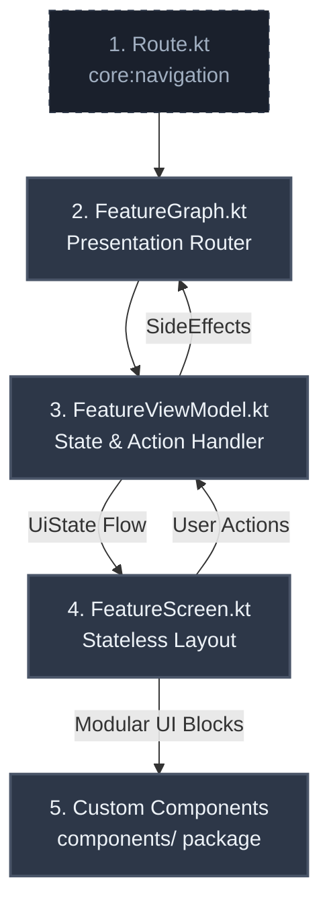

# 🛠️ MVI Agent Blueprint & Developer Guide
### Feature-Level Reference: `:feature:template`

This document serves as the **Gold-Standard Architectural Reference** for the SkillHub application. It is designed to act as a highly structured, copy-paste-ready blueprint for both software engineers and **AI coding agents** to implement new feature modules.

All new UI feature modules in SkillHub **MUST** strictly adhere to this Orbit MVI (Model-View-Intent) pattern, leveraging type-safe Jetpack Navigation 3, Dagger Hilt, and the `:core:designsystem` custom components.

---

## 📐 The Architecture Blueprint at a Glance

The feature architecture is divided into six separate layers, creating a highly testable, unidirectional flow of data and interaction:



---

## 🚀 Step-by-Step Feature Implementation Guide

To implement a new feature (e.g. `:feature:inbox` or a custom flow), follow these **six steps** sequentially.

### 📍 Step 1: Define Type-Safe Route Boundaries
Every feature screen's route is declared in the `:core:navigation` module inside `Route.kt` (`com.genesys.core.navigation.Route`). This allows multi-module navigation without importing feature modules.

> [!IMPORTANT]
> The route must implement `Route` (which extends `NavKey` and `Parcelable`), be `@Serializable`, and `@Parcelize`.

```kotlin
// Location: :core:navigation -> com.genesys.core.navigation.Route.kt

@Serializable
@Parcelize
data object Templates : Route

@Serializable
@Parcelize
data class TemplateDetail(
    val templateId: String
) : Route
```

---

### 🛡️ Step 2: Establish the MVI Contract
The Contract defines the immutable boundary between your Compose UI and your ViewModel. Create `[Feature]Contract.kt` (e.g., `MainContract.kt`).

```kotlin
// Location: :feature:template -> com.genesys.feature.template.main.MainContract.kt

package com.genesys.feature.template.main

import com.genesys.core.common.base.mvi.Action
import com.genesys.core.common.base.mvi.SideEffect
import com.genesys.core.common.base.mvi.UiState
import com.genesys.core.model.template.Template
import com.genesys.core.model.template.TemplateCollections

// 1. Immutable representation of the UI's state
data class MainUiState(
    val templateCollections: List<TemplateCollections> = emptyList(),
    val isLoading: Boolean = false,
    val errorMessage: String? = null
) : UiState

// 2. User intent actions dispatched from UI to ViewModel
sealed interface MainAction : Action {
    data object LoadTemplates : MainAction
    data class OnTemplateClicked(val template: Template) : MainAction
}

// 3. One-off non-persistent UI instructions (Navigation, Toasts, Dialogs)
sealed interface MainSideEffect : SideEffect {
    data class OpenTemplate(val templateId: String) : MainSideEffect
}
```

---

### 🧠 Step 3: Implement the MVI ViewModel
The ViewModel acts as the orchestrator of business rules. It extends `BaseViewModel` (from `:core:common`), initializes an Orbit MVI `container`, and maps incoming `Action` objects to background intents using clean `reduce` blocks and `postSideEffect`.

> [!TIP]
> Always handle asynchronous operations using Kotlin Flow collections. Use standard state copying (`state.copy(...)`) to update states inside Orbit's `reduce` function.

```kotlin
// Location: :feature:template -> com.genesys.feature.template.main.MainViewModel.kt

package com.genesys.feature.template.main

import com.genesys.core.common.base.BaseViewModel
import com.genesys.core.common.base.Result
import com.genesys.core.domain.usecase.template.GetAllTemplatesUseCase
import com.genesys.core.model.template.Template
import dagger.hilt.android.lifecycle.HiltViewModel
import javax.inject.Inject
import org.orbitmvi.orbit.viewmodel.container

@HiltViewModel
class MainViewModel @Inject constructor(
    private val getAllTemplatesUseCase: GetAllTemplatesUseCase
) : BaseViewModel<MainUiState, MainSideEffect, MainAction>() {

    // 1. Initialize MVI container with starting State
    override val container = container<MainUiState, MainSideEffect>(MainUiState())

    init {
        loadTemplates()
    }

    // 2. Single Entry Point for Actions
    override fun onAction(action: MainAction) {
        when (action) {
            MainAction.LoadTemplates -> loadTemplates()
            is MainAction.OnTemplateClicked -> onTemplateClicked(action.template)
        }
    }

    // 3. Intent Blocks for Business Logic Execution
    private fun loadTemplates() {
        intent {
            if (state.isLoading) return@intent

            getAllTemplatesUseCase().collect { result ->
                when (result) {
                    is Result.Loading -> reduce {
                        state.copy(
                            isLoading = true,
                            errorMessage = null
                        )
                    }
                    is Result.Success -> reduce {
                        state.copy(
                            templateCollections = result.data,
                            isLoading = false,
                            errorMessage = null
                        )
                    }
                    is Result.Error -> reduce {
                        state.copy(
                            isLoading = false,
                            errorMessage = result.msg ?: "Failed to load templates"
                        )
                    }
                    is Result.Initial -> Unit
                }
            }
        }
    }

    private fun onTemplateClicked(template: Template) {
        intent {
            postSideEffect(MainSideEffect.OpenTemplate(template.id))
        }
    }
}
```

---

### 🖥️ Step 4: Write the Stateless Screen Layout
The screen layout must be 100% stateless and decoupled from architecture models.
- **Never** pass Hilt ViewModels or Navigation controllers directly into a stateless Composable screen.
- Consume a single state object, and emit user interactions via explicit parameters or a single action callback.
- Make extensive use of core design system tokens.

```kotlin
// Location: :feature:template -> com.genesys.feature.template.main.TemplateScreen.kt

package com.genesys.feature.template.main

import androidx.compose.foundation.layout.PaddingValues
import androidx.compose.foundation.layout.fillMaxSize
import androidx.compose.runtime.Composable
import androidx.compose.ui.Modifier
import androidx.compose.ui.res.stringResource
import androidx.compose.ui.tooling.preview.Preview
import androidx.compose.ui.unit.dp
import com.genesys.core.designsystem.component.AppPageFrame
import com.genesys.core.designsystem.component.ErrorState
import com.genesys.core.designsystem.component.LoadingIndicator
import com.genesys.core.designsystem.theme.AppTheme
import com.genesys.core.model.template.Template
import com.genesys.feature.template.R
import com.genesys.feature.template.main.components.TemplateCollectionsList

@Composable
fun TemplateScreen(
    state: MainUiState,
    onRetry: () -> Unit,
    onTemplateClick: (Template) -> Unit,
    modifier: Modifier = Modifier
) {
    AppPageFrame(
        modifier = modifier,
        contentPadding = PaddingValues(0.dp)
    ) {
        when {
            state.isLoading -> {
                LoadingIndicator(modifier = Modifier.fillMaxSize())
            }
            state.errorMessage != null -> {
                ErrorState(
                    message = state.errorMessage ?: stringResource(R.string.template_error_generic),
                    onRetry = onRetry,
                    modifier = Modifier.fillMaxSize()
                )
            }
            else -> {
                TemplateCollectionsList(
                    collections = state.templateCollections,
                    onTemplateClick = onTemplateClick
                )
            }
        }
    }
}

@Preview
@Composable
private fun TemplateScreenPreview() {
    AppTheme {
        TemplateScreen(state = MainUiState(), onRetry = {}, onTemplateClick = {})
    }
}
```

---

### 🧩 Step 5: Implement Modular UI Components
To keep files clean, highly readable, and modular, **never** inline complex lists, hero banners, or cards within the main `Screen.kt`. Extract them into separate files under a `components/` package.

#### Reference: The `TemplateHero` Panel
Leverages `AppPanel` and `AppText` components using spacing & typography values from `AppTheme`:

```kotlin
// Location: :feature:template -> .../main/components/TemplateHero.kt

package com.genesys.feature.template.main.components

import androidx.compose.foundation.layout.Arrangement
import androidx.compose.foundation.layout.Column
import androidx.compose.foundation.layout.fillMaxWidth
import androidx.compose.foundation.layout.padding
import androidx.compose.runtime.Composable
import androidx.compose.ui.Modifier
import com.genesys.core.designsystem.component.AppPanel
import com.genesys.core.designsystem.component.AppPanelTone
import com.genesys.core.designsystem.component.AppText
import com.genesys.core.designsystem.theme.AppTheme

@Composable
fun TemplateHero(
    title: String,
    subtitle: String,
    modifier: Modifier = Modifier
) {
    AppPanel(
        modifier = modifier.fillMaxWidth(),
        tone = AppPanelTone.Normal
    ) {
        Column(
            modifier = Modifier.padding(AppTheme.spacing.lg),
            verticalArrangement = Arrangement.spacedBy(AppTheme.spacing.xs)
        ) {
            AppText(
                text = title,
                style = AppTheme.typography.titleLarge,
                color = AppTheme.colorScheme.colorText
            )
            AppText(
                text = subtitle,
                style = AppTheme.typography.bodyMedium,
                color = AppTheme.colorScheme.colorTextSecondary
            )
        }
    }
}
```

---

### 🔌 Step 6: Map Navigation & Hoisting in the Feature Graph
The feature `Graph` is the navigation boundary and glue layer. It is a Composable function that:
1. Instantiates your ViewModel using `@Composable hiltViewModel()`.
2. Connects state updates via `.collectAsState()`.
3. Sets up an event lifecycle callback via Orbit's `.collectSideEffect { ... }`.
4. Binds Route objects dynamically using Jetpack Navigation 3's type-safe `entryProvider`.

```kotlin
// Location: :feature:template -> com.genesys.feature.template.navigation.TemplateGraph.kt

package com.genesys.feature.template.navigation

import androidx.compose.runtime.Composable
import androidx.compose.runtime.getValue
import androidx.compose.ui.Modifier
import androidx.hilt.navigation.compose.hiltViewModel
import androidx.navigation3.runtime.NavBackStack
import androidx.navigation3.runtime.NavKey
import androidx.navigation3.runtime.entryProvider
import androidx.navigation3.ui.NavDisplay
import com.genesys.core.navigation.AppNavigator
import com.genesys.core.navigation.Route
import com.genesys.feature.template.main.MainAction
import com.genesys.feature.template.main.MainSideEffect
import com.genesys.feature.template.main.MainViewModel
import com.genesys.feature.template.main.TemplateDetailScreen
import com.genesys.feature.template.main.TemplateScreen
import org.orbitmvi.orbit.compose.collectAsState
import org.orbitmvi.orbit.compose.collectSideEffect

@Composable
fun TemplateGraph(
    backStack: NavBackStack<NavKey>,
    navigator: AppNavigator,
    modifier: Modifier = Modifier,
    viewModel: MainViewModel = hiltViewModel()
) {
    // 1. Gather Reacting State
    val state by viewModel.collectAsState()

    // 2. React to One-off UI Events
    viewModel.collectSideEffect { sideEffect ->
        when (sideEffect) {
            is MainSideEffect.OpenTemplate -> {
                navigator.navigate(Route.TemplateDetail(sideEffect.templateId))
            }
        }
    }

    // 3. Map Type-Safe Serializable Routes to Composable Screens
    val entries = entryProvider<NavKey> {
        entry<Route.Templates> {
            TemplateScreen(
                state = state,
                onRetry = { viewModel.onAction(MainAction.LoadTemplates) },
                onTemplateClick = { template ->
                    viewModel.onAction(MainAction.OnTemplateClicked(template))
                },
                modifier = modifier
            )
        }

        entry<Route.TemplateDetail> { destination ->
            TemplateDetailScreen(
                templateId = destination.templateId,
                onBack = navigator::popIfPossible,
                modifier = modifier
            )
        }
    }

    // 4. Render Active Composable Screen Stack
    NavDisplay(
        backStack = backStack,
        onBack = navigator::popIfPossible,
        entryProvider = entries,
        modifier = modifier
    )
}
```

---

## 🚨 Guidelines for AI Agents Implementing New Features

When you are requested to implement a new MVI feature or screen within this repository:

### 1. Verification Checklist for AI Agents
- [ ] **Dependency Setup**: Ensure `build.gradle.kts` in your feature module includes `:core:navigation`, `:core:designsystem`, `:core:common`, `:core:domain`, and Orbit compose libraries.
- [ ] **Type-Safe Route**: Check if the Route Serializable data object or class is registered under `:core:navigation` -> `Route.kt`.
- [ ] **Stateless Composable**: Make sure your primary screen files in the presentation package contain no Hilt ViewModels or Direct Navigation calls.
- [ ] **Extracted UI Components**: Check that any card item, list wrapper, or elaborate panel is cleanly moved into the `components/` package.
- [ ] **Orbit Container**: Ensure the ViewModel uses standard Orbit MVI DSL flow inside `intent { ... }` blocks with `reduce` and `postSideEffect`.
- [ ] **Design System Compliance**: Use design system primitives (`AppPageFrame`, `AppPanel`, `AppText`) instead of raw Compose `Box`, `Card`, or `Text`. Apply styling colors (`AppTheme.colorScheme.colorText`) and spacing values (`AppTheme.spacing.md`) strictly.

---

## 🤖 Prompt Template for Delegating to Subagents

If you are a orchestrator agent delegating to a coding subagent, copy-paste this precise instruction block:

```markdown
You are a developer subagent tasked with implementing a new feature in the SkillHub Android codebase.
Please study the `:feature:template` gold-standard reference implementation.

You must build the new feature following these files sequentially:
1. Define `@Serializable` Route in `:core:navigation` -> `Route.kt`.
2. Define a strict `[Feature]Contract.kt` declaring `UiState`, `Action`, and `SideEffect` interface contracts.
3. Write `[Feature]ViewModel.kt` implementing `BaseViewModel` with Hilt injection and Orbit MVI container actions.
4. Implement a stateless `[Feature]Screen.kt` utilizing `:core:designsystem` custom primitives (`AppPageFrame`, `AppPanel`, `AppText`).
5. Extract UI panels and list items into separate components inside `components/` package.
6. Map routes and wire the Orbit collecting states inside `[Feature]Graph.kt`.

Make sure that no ViewModel dependencies leak into the stateless screen, and comply fully with the design system styling.
```
