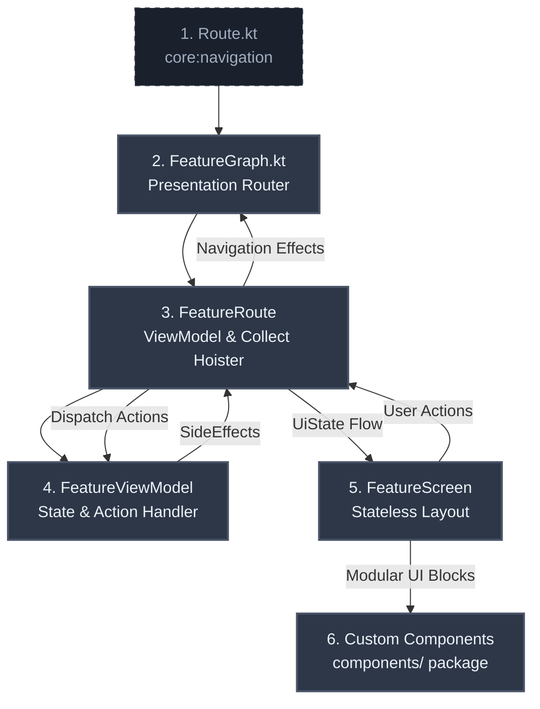

# 🛠️ MVI Agent Blueprint & Developer Guide
### Feature-Level Reference: `:feature:pokedex`

This document serves as the **Gold-Standard Architectural Reference** for the SkillHub application. It is designed to act as a highly structured, copy-paste-ready blueprint for both software engineers and **AI coding agents** to implement new feature modules.

All new UI feature modules in SkillHub **MUST** strictly adhere to this Orbit MVI (Model-View-Intent) pattern, leveraging type-safe Jetpack Navigation 3, Dagger Hilt, and the `:core:designsystem` custom components.

---

## 📐 The Architecture Blueprint at a Glance

The feature architecture is divided into six separate layers, creating a highly testable, unidirectional flow of data and interaction:



---

## 🚀 Step-by-Step Feature Implementation Guide

To implement a new feature (e.g. `:feature:feature1` or a custom flow), follow these **six steps** sequentially.

### 📍 Step 1: Define Type-Safe Route Boundaries
Every feature screen's route is declared in the `:core:navigation` module inside `Route.kt` (`com.genesys.core.navigation.Route`). This allows multi-module navigation without importing feature modules.

> [!IMPORTANT]
> The route must implement `Route` (which extends `NavKey` and `Parcelable`), be `@Serializable`, and `@Parcelize`.

```kotlin
// Location: :core:navigation -> com.genesys.core.navigation.Route.kt

@Serializable
@Parcelize
data object Pokedex : Route

@Serializable
@Parcelize
data class PokedexDetail(
    val pokedexId: String
) : Route
```

---

### 🛡️ Step 2: Establish the MVI Contract
The Contract defines the immutable boundary between your Compose UI and your ViewModel. Create `[Feature]Contract.kt` (e.g., `PokedexContract.kt`).

```kotlin
// Location: :feature:pokedex -> com.genesys.feature.pokedex.presentation.list.PokedexContract.kt

package com.genesys.feature.pokedex.presentation.list

import com.genesys.core.common.base.mvi.Action
import com.genesys.core.common.base.mvi.SideEffect
import com.genesys.core.common.base.mvi.UiState
import com.genesys.core.model.pokedex.Pokemon

// 1. Immutable representation of the UI's state
data class PokedexUiState(
    val pokemonList: List<Pokemon> = emptyList(),
    val isLoading: Boolean = false,
    val isLoadMoreLoading: Boolean = false,
    val searchQuery: String = "",
    val currentPage: Int = 0,
    val errorMessage: String? = null
) : UiState {
    val filteredPokemon: List<Pokemon>
        get() = if (searchQuery.isBlank()) {
            pokemonList
        } else {
            pokemonList.filter { it.name.contains(searchQuery, ignoreCase = true) }
        }
}

// 2. User intent actions dispatched from UI to ViewModel
sealed interface PokedexAction : Action {
    data object LoadPokedex : PokedexAction
    data object LoadNextPage : PokedexAction
    data class OnSearchQueryChanged(val query: String) : PokedexAction
    data class OnPokemonClicked(val pokemon: Pokemon) : PokedexAction
}

// 3. One-off non-persistent UI instructions (Navigation, Toasts, Dialogs)
sealed interface PokedexSideEffect : SideEffect {
    data class OpenPokedexDetail(val pokedexId: String) : PokedexSideEffect
}
```

---

### 🧠 Step 3: Implement the MVI ViewModel
The ViewModel acts as the orchestrator of business rules. It extends `BaseViewModel` (from `:core:common`), initializes an Orbit MVI `container`, and maps incoming `Action` objects to background intents using clean `reduce` blocks and `postSideEffect`.

> [!TIP]
> Always handle asynchronous operations using Kotlin Flow collections. Use standard state copying (`state.copy(...)`) to update states inside Orbit's `reduce` function.

```kotlin
// Location: :feature:pokedex -> com.genesys.feature.pokedex.presentation.list.PokedexViewModel.kt

package com.genesys.feature.pokedex.presentation.list

import com.genesys.core.common.base.BaseViewModel
import com.genesys.core.common.base.Result
import com.genesys.core.domain.usecase.pokedex.GetAllPokedexUseCase
import com.genesys.core.model.pokedex.Pokemon
import dagger.hilt.android.lifecycle.HiltViewModel
import javax.inject.Inject
import org.orbitmvi.orbit.viewmodel.container

@HiltViewModel
class PokedexViewModel @Inject constructor(
    private val getAllPokedexUseCase: GetAllPokedexUseCase
) : BaseViewModel<PokedexUiState, PokedexSideEffect, PokedexAction>() {

    // 1. Initialize MVI container with starting State
    override val container = container<PokedexUiState, PokedexSideEffect>(PokedexUiState())

    init {
        loadPokedex()
    }

    // 2. Single Entry Point for Actions
    override fun onAction(action: PokedexAction) {
        when (action) {
            PokedexAction.LoadPokedex -> loadPokedex()
            PokedexAction.LoadNextPage -> loadNextPage()
            is PokedexAction.OnSearchQueryChanged -> updateSearchQuery(action.query)
            is PokedexAction.OnPokemonClicked -> onPokemonClicked(action.pokemon)
        }
    }

    // 3. Intent Blocks for Business Logic Execution
    private fun loadPokedex() {
        intent {
            if (state.isLoading) return@intent

            getAllPokedexUseCase(page = 0).collect { result ->
                when (result) {
                    is Result.Loading -> reduce {
                        state.copy(isLoading = true, errorMessage = null)
                    }
                    is Result.Success -> reduce {
                        val newPokemon = result.data.flatMap { it.pokemon }
                        state.copy(
                            pokemonList = newPokemon,
                            currentPage = 0,
                            isLoading = false,
                            errorMessage = null
                        )
                    }
                    is Result.Error -> reduce {
                        state.copy(
                            isLoading = false,
                            errorMessage = result.msg ?: "Failed to load Pokedex"
                        )
                    }
                    is Result.Initial -> Unit
                }
            }
        }
    }

    private fun loadNextPage() {
        intent {
            if (state.isLoadMoreLoading || state.isLoading) return@intent
            val nextPage = state.currentPage + 1

            getAllPokedexUseCase(page = nextPage).collect { result ->
                when (result) {
                    is Result.Loading -> reduce {
                        state.copy(isLoadMoreLoading = true)
                    }
                    is Result.Success -> reduce {
                        val newPokemon = result.data.flatMap { it.pokemon }
                        val combined = (state.pokemonList + newPokemon).distinctBy { it.name }
                        state.copy(
                            pokemonList = combined,
                            currentPage = nextPage,
                            isLoadMoreLoading = false
                        )
                    }
                    is Result.Error -> reduce {
                        state.copy(isLoadMoreLoading = false)
                    }
                    is Result.Initial -> Unit
                }
            }
        }
    }

    private fun updateSearchQuery(query: String) {
        intent {
            reduce { state.copy(searchQuery = query) }
        }
    }

    private fun onPokemonClicked(pokemon: Pokemon) {
        intent {
            postSideEffect(PokedexSideEffect.OpenPokedexDetail(pokemon.name))
        }
    }
}
```

---

### 🖥️ Step 4: Write the Stateless Screen Layout
The screen layout must be 100% stateless and decoupled from architecture models.
- **Never** pass Hilt ViewModels or Navigation controllers directly into a stateless Composable screen.
- Consume a single state object, and emit user interactions via explicit parameters or a single action callback.
- Make extensive use of core design system tokens.

```kotlin
// Location: :feature:pokedex -> com.genesys.feature.pokedex.presentation.list.PokedexScreen.kt

package com.genesys.feature.pokedex.presentation.list

import androidx.compose.foundation.background
import androidx.compose.foundation.layout.Box
import androidx.compose.foundation.layout.Column
import androidx.compose.foundation.layout.PaddingValues
import androidx.compose.foundation.layout.fillMaxSize
import androidx.compose.foundation.layout.fillMaxWidth
import androidx.compose.foundation.layout.padding
import androidx.compose.runtime.Composable
import androidx.compose.ui.Alignment
import androidx.compose.ui.Modifier
import androidx.compose.ui.res.stringResource
import androidx.compose.ui.tooling.preview.Preview
import androidx.compose.ui.unit.dp
import com.genesys.core.designsystem.component.AppPageFrame
import com.genesys.core.designsystem.component.ErrorState
import com.genesys.core.designsystem.component.LoadingIndicator
import com.genesys.core.designsystem.theme.AppTheme
import com.genesys.core.model.pokedex.Pokemon
import com.genesys.feature.pokedex.R
import com.genesys.feature.pokedex.presentation.list.components.PokemonGrid
import com.genesys.feature.pokedex.presentation.list.components.PokemonSearchBar
import com.genesys.feature.pokedex.presentation.list.components.PokedexHeader

@Composable
fun PokedexScreen(
    state: PokedexUiState,
    onRetry: () -> Unit,
    onLoadNextPage: () -> Unit,
    onSearchQueryChanged: (String) -> Unit,
    onPokemonClick: (Pokemon) -> Unit,
    modifier: Modifier = Modifier
) {
    AppPageFrame(
        modifier = modifier
            .fillMaxSize()
            .background(AppTheme.colorScheme.colorBgLayout),
        contentPadding = PaddingValues(0.dp)
    ) {
        Column(
            modifier = Modifier
                .fillMaxSize()
                .padding(horizontal = AppTheme.spacing.md)
        ) {
            PokedexHeader()

            PokemonSearchBar(
                query = state.searchQuery,
                onQueryChanged = onSearchQueryChanged
            )

            Box(
                modifier = Modifier
                    .fillMaxWidth()
                    .weight(1f),
                contentAlignment = Alignment.Center
            ) {
                when {
                    state.isLoading && state.pokemonList.isEmpty() -> {
                        LoadingIndicator()
                    }
                    state.errorMessage != null && state.pokemonList.isEmpty() -> {
                        ErrorState(
                            message = state.errorMessage ?: stringResource(R.string.pokedex_error_generic),
                            onRetry = onRetry
                        )
                    }
                    else -> {
                        PokemonGrid(
                            pokemonList = state.filteredPokemon,
                            isLoadMoreLoading = state.isLoadMoreLoading,
                            showLoadMore = state.searchQuery.isBlank() && state.pokemonList.isNotEmpty(),
                            onLoadNextPage = onLoadNextPage,
                            onPokemonClick = onPokemonClick,
                            modifier = Modifier.fillMaxSize()
                        )
                    }
                }
            }
        }
    }
}
```

---

### 🧩 Step 5: Implement Modular UI Components
To keep files clean, highly readable, and modular, **never** inline complex lists, headers, or cards within the main `Screen.kt`. Extract them into separate files under a `components/` package.

#### Reference: The `PokemonCard` Component
Leverages `AppPanel` and custom styling values from `AppTheme`:

```kotlin
// Location: :feature:pokedex -> .../list/components/PokemonCard.kt

package com.genesys.feature.pokedex.presentation.list.components

import androidx.compose.foundation.clickable
import androidx.compose.foundation.layout.*
import androidx.compose.runtime.Composable
import androidx.compose.ui.Modifier
import com.genesys.core.designsystem.component.AppPanel
import com.genesys.core.designsystem.component.AppText
import com.genesys.core.designsystem.theme.AppTheme
import com.genesys.core.model.pokedex.Pokemon

@Composable
fun PokemonCard(
    pokemon: Pokemon,
    onClick: () -> Unit,
    modifier: Modifier = Modifier
) {
    AppPanel(
        modifier = modifier
            .fillMaxWidth()
            .clickable(onClick = onClick)
    ) {
        Column(
            modifier = Modifier.padding(AppTheme.spacing.md),
            verticalArrangement = Arrangement.spacedBy(AppTheme.spacing.xs)
        ) {
            AppText(
                text = pokemon.name.replaceFirstChar { it.uppercase() },
                style = AppTheme.typography.titleMedium,
                color = AppTheme.colorScheme.colorText
            )
        }
    }
}
```

---

### 🔌 Step 6: Map Navigation & Route Hoisting

To maintain perfect segregation, the feature uses a two-tier hoisting pattern in the navigation package:
1. **`[Feature]Route`**: A Composable function that hoists the ViewModel, collects the state using `.collectAsState()`, intercepts side-effects using `.collectSideEffect { ... }`, and binds actions to ViewModel calls.
2. **`[Feature]Graph`**: Binds the type-safe Navigation 3 `Route` entries and routes to the appropriate hoisting screen.

#### Tier 1: The Screen Hoisting Route (`PokedexRoute`)
```kotlin
// Location: :feature:pokedex -> .../list/PokedexScreen.kt (same file or separate Route file)

@Composable
fun PokedexRoute(
    navigator: AppNavigator,
    modifier: Modifier = Modifier,
    viewModel: PokedexViewModel = hiltViewModel()
) {
    val state by viewModel.collectAsState()

    viewModel.collectSideEffect { sideEffect ->
        when (sideEffect) {
            is PokedexSideEffect.OpenPokedexDetail -> {
                navigator.navigate(Route.PokedexDetail(sideEffect.pokedexId))
            }
        }
    }

    PokedexScreen(
        state = state,
        onRetry = { viewModel.onAction(PokedexAction.LoadPokedex) },
        onLoadNextPage = { viewModel.onAction(PokedexAction.LoadNextPage) },
        onSearchQueryChanged = { query -> viewModel.onAction(PokedexAction.OnSearchQueryChanged(query)) },
        onPokemonClick = { pokemon ->
            viewModel.onAction(PokedexAction.OnPokemonClicked(pokemon))
        },
        modifier = modifier
    )
}
```

#### Tier 2: The Orchestration Graph (`PokedexGraph`)
```kotlin
// Location: :feature:pokedex -> com.genesys.feature.pokedex.navigation.PokedexGraph.kt

package com.genesys.feature.pokedex.navigation

import androidx.compose.runtime.Composable
import androidx.compose.ui.Modifier
import com.genesys.core.navigation.AppNavigator
import com.genesys.core.navigation.Route
import androidx.navigation3.runtime.NavBackStack
import androidx.navigation3.runtime.NavKey
import androidx.navigation3.runtime.entryProvider
import androidx.navigation3.ui.NavDisplay
import com.genesys.feature.pokedex.presentation.detail.PokedexDetailRoute
import com.genesys.feature.pokedex.presentation.list.PokedexRoute

@Composable
fun PokedexGraph(
    backStack: NavBackStack<NavKey>,
    navigator: AppNavigator,
    modifier: Modifier = Modifier
) {
    val entries = entryProvider<NavKey> {
        entry<Route.Pokedex> {
            PokedexRoute(
                navigator = navigator,
                modifier = modifier
            )
        }

        entry<Route.PokedexDetail> { destination ->
            PokedexDetailRoute(
                pokedexId = destination.pokedexId,
                onBack = navigator::popIfPossible,
                modifier = modifier
            )
        }
    }

    NavDisplay(
        backStack = backStack,
        onBack = navigator::popIfPossible,
        entryProvider = entries,
        modifier = modifier
    )
}
```

---

## 🚨 Guidelines for AI Agents Implementing New Features

When you are requested to implement a new MVI feature or screen within this repository:

### 1. Verification Checklist for AI Agents
- [ ] **Dependency Setup**: Ensure `build.gradle.kts` in your feature module includes `:core:navigation`, `:core:designsystem`, `:core:common`, `:core:domain`, and Orbit compose libraries.
- [ ] **Type-Safe Route**: Check if the Route Serializable data object or class is registered under `:core:navigation` -> `Route.kt`.
- [ ] **Stateless Composable**: Make sure your primary screen files in the presentation package contain no Hilt ViewModels or Direct Navigation calls.
- [ ] **Hoisting Route Wrapper**: Implement a `[Feature]Route` wrapper to handle VM collection and side-effects.
- [ ] **Extracted UI Components**: Check that any card item, list wrapper, or elaborate panel is cleanly moved into the `components/` package.
- [ ] **Orbit Container**: Ensure the ViewModel uses standard Orbit MVI DSL flow inside `intent { ... }` blocks with `reduce` and `postSideEffect`.
- [ ] **Design System Compliance**: Use design system primitives (`AppPageFrame`, `AppPanel`, `AppText`) instead of raw Compose `Box`, `Card`, or `Text`. Apply styling colors (`AppTheme.colorScheme.colorText`) and spacing values (`AppTheme.spacing.md`) strictly.

---

## 🤖 Prompt Template for Delegating to Subagents

If you are an orchestrator agent delegating to a coding subagent, copy-paste this precise instruction block:

```markdown
You are a developer subagent tasked with implementing a new feature in the SkillHub Android codebase.
Please study the `:feature:pokedex` gold-standard reference implementation.

You must build the new feature following these files sequentially:
1. Define `@Serializable` Route in `:core:navigation` -> `Route.kt`.
2. Define a strict `[Feature]Contract.kt` declaring `UiState`, `Action`, and `SideEffect` interface contracts.
3. Write `[Feature]ViewModel.kt` implementing `BaseViewModel` with Hilt injection and Orbit MVI container actions.
4. Implement a stateless `[Feature]Screen.kt` utilizing `:core:designsystem` custom primitives (`AppPageFrame`, `AppPanel`, `AppText`).
5. Extract UI panels and list items into separate components inside `components/` package.
6. Create a `[Feature]Route` composable hoister wrapper to connect the stateless Screen with the VM container.
7. Map routes and wire the entry providers inside `[Feature]Graph.kt`.

Make sure that no ViewModel dependencies leak into the stateless screen, and comply fully with the design system styling.
```
