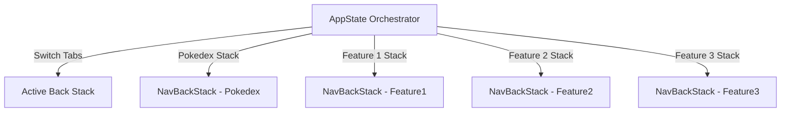

# 🧭 Jetpack Navigation 3 Architecture Guide

This document outlines the modern, strongly-typed native navigation architecture utilized throughout the application.

---

## 🔍 Overview & Key Pillars

The application implements the modern **Jetpack Navigation 3** (`androidx.navigation3`) library. This setup abandons string-based routing, Uri matching, and argument bundle hacking in favor of a **strongly-typed, object-oriented** system based on Kotlin `Serializable` types.

The three architecture pillars of this system are:
1. **Multiple Back Stacks**: Independent back stacks are maintained for each top-level tab, preserving visual screen history when switching tabs natively.
2. **Type-Safe Arguments**: Arguments are native properties of `@Serializable` `Route` objects, passed cleanly down to composables and automatically extracted via Hilt `SavedStateHandle`.
3. **Decoupled Orchestration**: Feature modules do not depend on each other. Instead, all features interact through `:core:navigation`, and cross-feature routing is coordinated via composition at the `app` module boundary.

---

## 🧩 Core Architecture Components

### 1. The `Route` Contract (`:core:navigation`)
Every screen in the application is represented by a type extending the `Route` sealed interface. This interface inherits from Navigation 3 `NavKey` and Android `Parcelable`.

> [!IMPORTANT]
> - **No-argument screens** must be defined as `@Serializable @Parcelize data object`.
> - **Screens with arguments** must be defined as `@Serializable @Parcelize data class`.
>
> All routes reside in [Route.kt](file:///d:/Quest/CodeBaseCompose/core/navigation/src/main/java/com/genesys/core/navigation/Route.kt).

```kotlin
// Location: :core:navigation -> com.genesys.core.navigation.Route.kt

sealed interface Route : NavKey, Parcelable {
    @Serializable
    @Parcelize
    data object Pokedex : Route

    @Serializable
    @Parcelize
    data class PokedexDetail(
        val pokedexId: String
    ) : Route

    @Serializable
    @Parcelize
    data object Feature1 : Route

    @Serializable
    @Parcelize
    data object Feature2 : Route

    @Serializable
    @Parcelize
    data object Feature3 : Route
}
```

### 2. The `AppNavigator` Abstraction (`:core:navigation`)
A lightweight, reactive wrapper around the active back stack that abstracts common navigation controls away from Compose screens.

- `navigate(route: Route)`: Pushes a new screen onto the active stack.
- `popIfPossible()`: Pops the top screen if the active stack contains more than one screen.
- `popToRoot()`: Pops all screens back to the root of the active top-level stack.
- `canPop`: A state property indicating whether the stack can be popped (useful for managing system back button behaviors and hiding/showing UI wrappers).

### 3. Multiple Back Stacks & `AppState` (`app` module)
The application maintains separate, independent back stacks for every bottom-tab destination. The orchestration is defined in [NavHost.kt](file:///d:/Quest/CodeBaseCompose/app/src/main/java/com/genesys/codebase/navigation/NavHost.kt) through `AppState`.



When a user switches bottom tabs, `AppState` swaps out the active back stack and its associated `AppNavigator` instance, preserving the full navigation state and view hierarchy of inactive tabs.

---

## 🚀 Feature Implementation Flow

To add a new screen or flow to the application, follow this standardized flow:

### 📍 Step 1: Declare the Route
Register your route in [Route.kt](file:///d:/Quest/CodeBaseCompose/core/navigation/src/main/java/com/genesys/core/navigation/Route.kt):
```kotlin
@Serializable
@Parcelize
data class MyNewDetail(val itemId: Int) : Route
```

### 🔌 Step 2: Establish the Two-Tier Screen Hoisting Pattern
To keep navigation configuration and business logic separate from layout code, we use a **Two-Tier Hoisting Pattern**:

1. **`[Feature]Route` Composable (Screen-level Hoister)**: Hoists the ViewModel (`hiltViewModel()`), collects Orbit MVI states, handles side effects (such as displaying toasts, popups, or requesting navigation), and binds UI callback actions.
2. **`[Feature]Graph` Composable (Navigation Graph)**: Maps type-safe `Route` classes to their associated screen-level hoisting routes inside the `entryProvider`.

#### Tier 1: Screen-Level Hoister (`MyFeatureRoute`)
```kotlin
@Composable
fun MyDetailRoute(
    onBack: () -> Unit,
    modifier: Modifier = Modifier,
    viewModel: MyDetailViewModel = hiltViewModel()
) {
    val state by viewModel.collectAsState()

    // Handle MVI side-effects (e.g. system warnings or external actions)
    viewModel.collectSideEffect { sideEffect ->
        when (sideEffect) {
            is MyDetailSideEffect.ShowToast -> { /* ... */ }
        }
    }

    MyDetailScreen(
        state = state,
        onBack = onBack,
        onAction = viewModel::onAction,
        modifier = modifier
    )
}
```

#### Tier 2: The Orchestration Graph (`MyFeatureGraph`)
```kotlin
@Composable
fun MyFeatureGraph(
    backStack: NavBackStack<NavKey>,
    navigator: AppNavigator,
    modifier: Modifier = Modifier
) {
    val entries = entryProvider<NavKey> {
        entry<Route.MyRootScreen> {
            MyRootRoute(
                navigator = navigator,
                modifier = modifier
            )
        }

        entry<Route.MyNewDetail> { destination ->
            // Option A: Extract arguments directly from the destination object
            MyDetailRoute(
                itemId = destination.itemId,
                onBack = navigator::popIfPossible,
                modifier = modifier
            )
        }
    }

    NavDisplay(
        backStack = backStack,
        onBack = navigator::popIfPossible,
        entryProvider = entries,
        modifier = modifier
    )
}
```

> [!TIP]
> **Option B (Recommended for Hilt)**: You can omit passing arguments manually to the Route composable. Hilt's `SavedStateHandle` automatically extracts properties (e.g. `itemId`) directly from the active Navigation 3 back stack entry state inside your ViewModel:
> ```kotlin
> @HiltViewModel
> class MyDetailViewModel @Inject constructor(
>     savedStateHandle: SavedStateHandle
> ) : ViewModel() {
>     private val itemId: Int = savedStateHandle["itemId"] ?: 0
> }
> ```

---

## 🎨 UI Behaviors & Navigation Integration

### 1. Bottom Bar Visibility
The app's bottom bar visibility is driven dynamically by `AppState.showBottomBar`. It is calculated as:
```kotlin
val showBottomBar: Boolean get() = !activeNavigator.canPop
```
This ensures the bottom navigation bar is **only visible on the root screen** of any given tab. Whenever a user navigates deeper into a tab's back stack, the bar transitions away automatically to provide a fully focused content experience.

### 2. System Back Handler
A custom back handler at the root `NavHost` orchestrates system back-press events cleanly:
```kotlin
BackHandler(enabled = appState.activeNavigator.canPop || appState.currentDestination != TopLevelDestination.Pokedex) {
    appState.handleBack()
}
```
`appState.handleBack()` implements the following traversal pattern:
1. **Try Pop Active Stack**: Pop the top screen of the active back stack if possible.
2. **Tab Redirection**: If the active stack is at its root screen and is not the primary tab (`Pokedex`), switch the active destination back to `Pokedex`.
3. **Exit App**: If the user is at the root screen of the primary tab, exit the application.

---

## 🔀 Cross-Feature Navigation

To maintain maximum module separation, feature modules (e.g., `:feature:pokedex`, `:feature:feature1`) **must never depend directly on each other**. 

If a feature graph needs to transition to a screen in another module, the orchestration occurs through the `:core:navigation` routes and is wired together in the `app` module.

### Approach A: Top-Level Tab Switching (Callbacks)
If a screen needs to transition to a root screen on another bottom tab:
1. Pass a callback function parameter (e.g., `onNavigateToFeature1: () -> Unit`) down through your feature graph.
2. In [NavHost.kt](file:///d:/Quest/CodeBaseCompose/app/src/main/java/com/genesys/codebase/navigation/NavHost.kt), map this callback to `appState.selectDestination(TopLevelDestination.Feature1)`.

### Approach B: Injected Screen Composable (Lambda Injection)
If a graph needs to display a screen from another module *within* its own stack, it receives that screen as a `@Composable` lambda.

#### 1. Define the Lambda Parameter in your Graph
```kotlin
@Composable
fun PokedexGraph(
    backStack: NavBackStack<NavKey>,
    navigator: AppNavigator,
    // Inject the external screen composable here!
    externalFeatureScreen: @Composable (id: String, onBack: () -> Unit) -> Unit,
    modifier: Modifier = Modifier
) {
    val entries = entryProvider<NavKey> {
        // ... local screen mappings ...

        entry<Route.ExternalRoute> { destination ->
            externalFeatureScreen(
                id = destination.id,
                onBack = navigator::popIfPossible
            )
        }
    }
    // ...
}
```

#### 2. Wire the Screens inside the `app` module
Because `NavHost` in the `app` module depends on all features, it can wire screens together seamlessly:
```kotlin
import com.genesys.feature.feature1.main.Feature1Screen

// ...

TopLevelDestination.Pokedex -> PokedexGraph(
    backStack = backStack,
    navigator = navigator,
    externalFeatureScreen = { id, onBack ->
        // Call the composable from the target feature module directly
        Feature1Screen(
            modifier = fillModifier
        )
    },
    modifier = fillModifier
)
```
